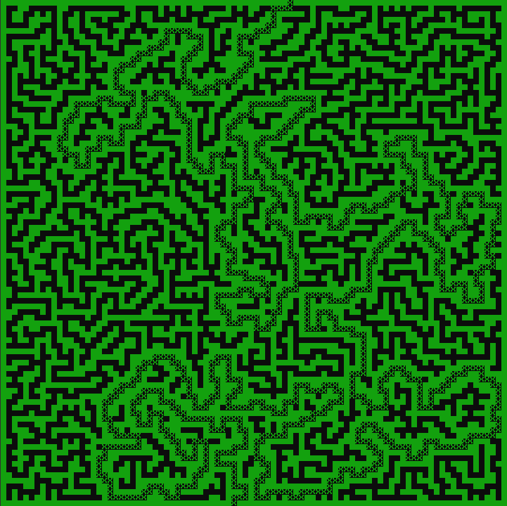

## Overview
This program generates a maze of specified dimensions (x and y) and finds paths through the maze using the right-hand rule method. The right-hand rule method is a simple algorithm for traversing a maze that ensures reaching the exit by keeping the right hand always in contact with the wall.

